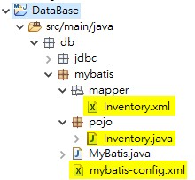
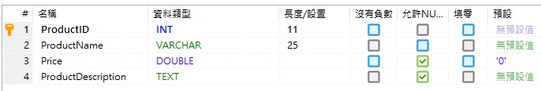

# 用MyBatis存取資料庫

使用MyBatis時，最主要是要告訴他，資料庫在哪裡？SQL Command及POJO class在哪裡？ 因此，我先切成兩個部份，一個是MyBatis所需的配置，另一個是我們要存取資料表所定義的類別配置。

|  | MyBatis所需的配置 |
| :--- | :--- |
| 配置檔/類別 | mybatis-config.xml |
| code | `String resource = "db/mybatis/mybatis-config.xml"; InputStream inputStream = Resources.getResourceAsStream(resource); SqlSessionFactory sqlSessionFactory = new SqlSessionFactoryBuilder().build(inputStream); SqlSession session = sqlSessionFactory.openSession();` |

|  | 存取資料表所定義的類別配置 |
| :--- | :--- |
| 配置檔/類別 | Inventory.xml Inventory.java |
| Code | `List inventoryList; inventoryList = session.selectList("listInventory"); inventoryList.forEach(     x -> System.out.printf("%d\t%s\t%f\t%s\n", x.getProductID(),       x.getProductName(), x.getPrice(), x.getDescription())); session.close();` |

以下是目錄結構



mybatis-config.xml MyBatis配置檔

```markup
<?xml version="1.0" encoding="UTF-8"?>
<!DOCTYPE configuration PUBLIC "-//mybatis.org//DTD Config 3.0//EN" "http://mybatis.org/dtd/mybatis-3-config.dtd">
<configuration>
	<environments default="development">
		<environment id="development">
			<transactionManager type="JDBC" />
			<dataSource type="POOLED">
				<property name="driver" value="com.mysql.cj.jdbc.Driver" />
				<property name="url"
					value="jdbc:mysql://127.0.0.1:3306/TestData?characterEncoding=UTF-8" />
				<property name="username" value="admin" />
				<property name="password" value="xxxxxxxx" />
			</dataSource>
		</environment>
		
		<environment id="MSSQL">
            <transactionManager type="JDBC" />
            <dataSource type="POOLED">
                <property name="driver" value="com.microsoft.sqlserver.jdbc.SQLServerDriver" />
                <property name="url"
                    value="jdbc:sqlserver://127.0.0.1:1433;Database=TestData" />
                <property name="username" value="sa" />
                <property name="password" value="xxxxxxxx" />
            </dataSource>
        </environment>
	</environments>
	<!-- 映射文件 -->
	<mappers>
		<mapper resource="db/mybatis/mapper/Inventory.xml" />
	</mappers> 
</configuration>
```

資料表結構



POJO file: Inventory.java

```java
package db.mybatis.pojo;

public class Inventory {
	private Integer productID = 0;
	private String productName = "";
	private Double price = 0.0;
	private String description = "";
	
	public Integer getProductID() {
		return productID;
	}
	public void setProductID(Integer productID) {
		this.productID = productID;
	}
	public String getProductName() {
		return productName;
	}
	public void setProductName(String productName) {
		this.productName = productName;
	}
	public Double getPrice() {
		return price;
	}
	public void setPrice(Double price) {
		this.price = price;
	}
	public String getDescription() {
		return description;
	}
	public void setDescription(String productDescription) {
		this.description = productDescription;
	}
}
```

SQL Command config file: Inventory.xml

```markup
<?xml version="1.0" encoding="UTF-8"?>
<!DOCTYPE mapper PUBLIC "-//mybatis.org//DTD Mapper 3.0//EN" "http://mybatis.org/dtd/mybatis-3-mapper.dtd">
<mapper namespace="mapper">
	<!--<select id="listInventory" resultType="db.mybatis.pojo.Inventory"> --> <!-- resultType是指的回傳對映到哪一個pojo class -->
	<select id="listInventory" resultMap="userResultMap"> <!-- resultMap是指對映到哪一個resultMap tag -->
		select * from Products order by productid desc
	</select>

	<resultMap id="userResultMap" type="db.mybatis.pojo.Inventory"> <!-- type是指的回傳對映到哪一個pojo class -->
		<id property="productID" column="ProductID" />
		<result property="productName" column="ProductName" />
		<result property="price" column="Price" />
		<result property="description" column="ProductDescription" />
	</resultMap>

	<select id="singleInventory"
		resultType="db.mybatis.pojo.Inventory"> <!-- resultType是指的回傳對映到哪一個pojo class -->
		select productid, productname, price, productdescription AS
		description from Products where productid = #{id}
	</select>

	<select id="queryInventory"
		resultType="db.mybatis.pojo.Inventory"> <!-- resultType是指的回傳對映到哪一個pojo class -->
		select productid, productname, price, productdescription AS
		description from Products where productname like #{word}
	</select>

	<insert id="addInventory"
		parameterType="db.mybatis.pojo.Inventory">
		insert into Products (productid, productname, price, productdescription)
		values (#{productID},#{productName},#{price},#{description})
	</insert>
	
	<insert id="addMultiInventory"
        parameterType="db.mybatis.pojo.Inventory">
        insert into Products (productid, productname, price, productdescription)
        values 
        <foreach item="item" collection="list" separator=",">
            (#{item.productID}, #{item.productName}, #{item.price}, #{item.description})
        </foreach>
    </insert>
</mapper>
```

## Annonation

我們還可以簡化，把mapper xml config省略；新增一個interface，把要執行的SQL語句寫在裡面，並同時宣告一個方法，再把該interface寫在mybatis-config.xml裡，如下說明

InvInterface.java file

```java
package db.mybatis.mapper;

import java.util.List;
import org.apache.ibatis.annotations.Param;
import org.apache.ibatis.annotations.Select;
import db.mybatis.pojo.Inventory;

public interface InvInterface {
	@Select("select * from Products where ${column} > #{value}")
	List<Inventory> findByColumn(@Param("column") String column, @Param("value") String value);
}
```

mybatis-config.xml file 新增mapper

```markup
<mappers>
	<mapper class="db.mybatis.mapper.InvInterface" />
</mappers>
```

how to use?

```java
session = sqlSessionFactory.openSession();
List<Inventory> inventoryList;
InvInterface mapper = session.getMapper(InvInterface.class);
inventoryList = mapper.findByColumn("price", "5555");
```

ref: [https://www.concretepage.com/mybatis-3/mybatis-3-annotation-example-with-select-insert-update-and-delete](https://www.concretepage.com/mybatis-3/mybatis-3-annotation-example-with-select-insert-update-and-delete)


