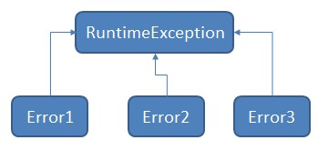

# Spring exception

## Scenario

我們寫了一個RESTful API，再回傳給使用者前可以有一些錯誤檢查，且如果有問題則回傳錯誤訊息。\(四則運算\)



```bash
{"function":"add", "number1":3, "number2":5}
```





```bash
{"isSuccess":true, "result":8}
```





```bash
{"isSuccess":false, "errorCode":520, "errorMessage":"It can't be operation with number."}
```



## @ExceptionHandler



@ExceptionHandler所宣告處理的方法，只限定在該類別當中，意思是，若其他類別也丟出定義的exception class，那麼將不會被處理；因為找不到，後面會再提到。

最上面的那張圖指的是，我們會透過自訂的錯誤類別，再去繼承RuntimeException類別，這樣在程式中拋出例外才不會繼續往下執行；因此，自訂的錯誤類別有主要兩個功用，第一個是在抛出例外前把該錯誤碼及錯誤訊息寫入到錯誤類別；第二個是錯誤分級，可以讓@ExceptionHandler攔截不同的錯誤類別。

## HandlerExceptionResolver


## @ControllerAdvice

